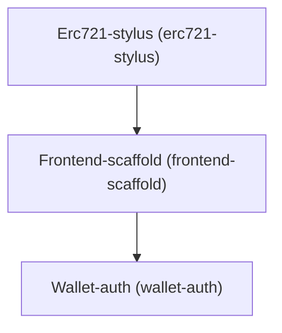

# Architecture

## Dependency Graph

```mermaid
graph TD
  9627ffcf["Erc721-stylus (erc721-stylus)"]
  6e176151["Frontend-scaffold (frontend-scaffold)"]
  74be6d21["Wallet-auth (wallet-auth)"]
  9627ffcf --> 6e176151
  6e176151 --> 74be6d21
```

## Execution / Implementation Order

1. **Erc721-stylus** (`9627ffcf`)
2. **Frontend-scaffold** (`6e176151`)
3. **Wallet-auth** (`74be6d21`)
